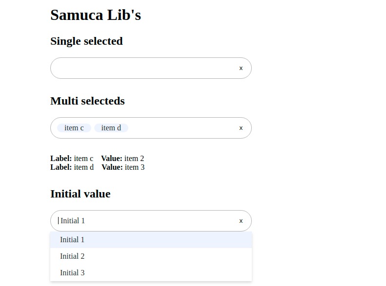

# Samuca Lib's

### Custom React Components

React library with frontend development support components.

## MultiSelectAria

The Select control for React.

## Props

| Field              | Type         | Required | Default        | Description                                                                          |
| ------------------ | ------------ | -------- | -------------- | ------------------------------------------------------------------------------------ |
| labelKey           | string       | no       | label          | Field name for the label.                                                            |
| valueKey           | string       | no       | value          | Field name for the value.                                                            |
| options            | array        | yes      |                | Array of options, should contains objects with labelKey and valueKey fields.         |
| selected           | object/array | yes      |                | Array or Object selected, should contains objects with labelKey and valueKey fields. |
| onSelect           | func         | yes      |                | Fuction to change list of selecteds.                                                 |
| onInputChange      | func         | false    |                | Return the string typed.                                                             |
| isLoadingText      | string       | no       | It's Loading   | Text displayed when options is loading.                                              |
| noResultsText      | string       | no       | It's empty     | Text displayed when there are no options.                                            |
| searchPromptText   | string       | no       | Type to search | Text for guidance.                                                                   |
| placeholder        | string       | no       |                | Placeholder for input.                                                               |
| isLoading          | bool         | no       | false          | Indcate if options are loading.                                                      |
| classContainer     | string       | no       |                | Class for overwrite design.                                                          |
| classBox           | string       | no       |                | Class for overwrite design.                                                          |
| classChip          | string       | no       |                | Class for overwrite design.                                                          |
| classInput         | string       | no       |                | Class for overwrite design.                                                          |
| classClearButton   | string       | no       |                | Class for overwrite design.                                                          |
| classOptions       | string       | no       |                | Class for overwrite design.                                                          |
| classOptionsItem   | string       | no       |                | Class for overwrite design.                                                          |
| listName           | string       | no       | list           | ID for list of options.                                                              |
| id                 | string       | no       | undefined      | ID for component                                                                     |
| minimumInput       | number       | no       | 3              | Minimum characters to search start.                                                  |
| multi              | bool         | no       | false          | Allows multiple choices.                                                             |
| statick            | bool         | no       | false          | If true don't reload options.                                                        |
| showOptionSelected | bool         | no       | false          | Show the items selecteds in list options.                                            |


### Example

```
import React from 'react';
import MultiSelectAria from './lib/components/multi-select-aria/multi-select-aria';

class App extends React.Component {

  constructor(props) {
    super(props);
    this.state= {
      options: [],
      selecteds: [{label: 'item c', value: 'item 2'}],
      initialValue: {label: 'Initial 1', value: 1},
      selectedsForInitialValueExample: [],
      selected: null,
      isLoading: false
    }
  }

  onFilter = (value) => {

    const options = [{label: 'item a', value: 'item 1'},
      {label: 'item c', value: 'item 2'},
      {label: 'item d', value: 'item 3'},
      {label: 'item e', value: 'item 4'},
      {label: 'item f', value: 'item 5'},
      {label: 'item g', value: 'item 6'},
      {label: 'item h', value: 'item 7'}
    ]

    if (value) {
      this.setState({...this.state, isLoading: true});
      let optionsFiltered = options.filter((item) => item.label && item.label.toLowerCase().includes(value.toLowerCase()));
      setTimeout(() => {
        this.setState({...this.state, options: optionsFiltered, isLoading: false});
      }, 2000);
    }
  }

  onSingleSelect = (item) => {
    this.setState({...this.state, selected: item});
  }

  onSelect = (items) => {
    this.setState({...this.state, selecteds: items});
  }

  render(){

    return (
      <div className="App">
        <div style={{display: 'flex', justifyContent: 'center'}}>
          <div style={{width: '800px'}}>
            <h1>Samuca Lib's</h1>
            <div style={{width: '50%'}}>
              <h2>Single selected</h2>
              <MultiSelectAria 
                isLoading={this.state.isLoading}
                options={this.state.options}
                onInputChange={(e) => this.onFilter(e)}
                onSelect={(item) => this.onSingleSelect(item)}
                labelKey={'label'}
                valueKey={'value'}
                multi={false}
                selecteds={this.state.selecteds}
              />
              {
                this.state.selected && 
                <div style={{marginTop: '2rem'}}>
                  <strong>Label: </strong>{this.state.selected.label}
                  <strong style={{marginLeft: '1rem'}}>Value: </strong>{this.state.selected.value}
                </div>
              }
            </div>
            <div style={{width: '50%', marginTop: '2rem'}}>
              <h2>Multi selecteds</h2>
              <MultiSelectAria 
                isLoading={this.state.isLoading}
                options={this.state.options}
                onInputChange={(e) => this.onFilter(e)}
                onSelect={(items) => this.onSelect(items)}
                labelKey={'label'}
                valueKey={'value'}
                multi={true}
                selecteds={this.state.selecteds}
              />
              <div style={{marginTop: '2rem'}}>
              {
                this.state.selecteds.map((item, i)=> (
                    <div key={i} >
                      <strong>Label: </strong>{item.label}
                      <strong style={{marginLeft: '1rem'}}>Value: </strong>{item.value}
                    </div>
                ))
              }
              </div>
            </div>
            <div style={{width: '50%', marginTop: '2rem'}}>
              <h2>Initial value</h2>
              <MultiSelectAria 
                isLoading={this.state.isLoading}
                options={[
                  {label: 'Initial 1', value: 1},
                  {label: 'Initial 2', value: 2},
                  {label: 'Initial 3', value: 3}
                ]}
                onSelect={(selectedsForInitialValueExample) => 
                  this.setState({...this.state, selectedsForInitialValueExample})}
                labelKey={'label'}
                valueKey={'value'}
                initialValue={this.state.initialValue}
                static={true}
                multi={false}
                selecteds={this.state.selecteds}
              />
              <div style={{marginTop: '2rem'}}>
              {
                <div>
                  <strong>Label: </strong>{this.state.selectedsForInitialValueExample.label}
                  <strong style={{marginLeft: '1rem'}}>Value: </strong>{this.state.selectedsForInitialValueExample.value}
                </div>
              }
              </div>
            </div>
          </div>
        </div>
      </div>
    )
  }
}

export default App;
```


